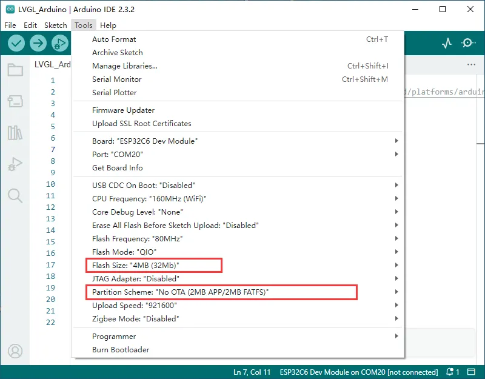
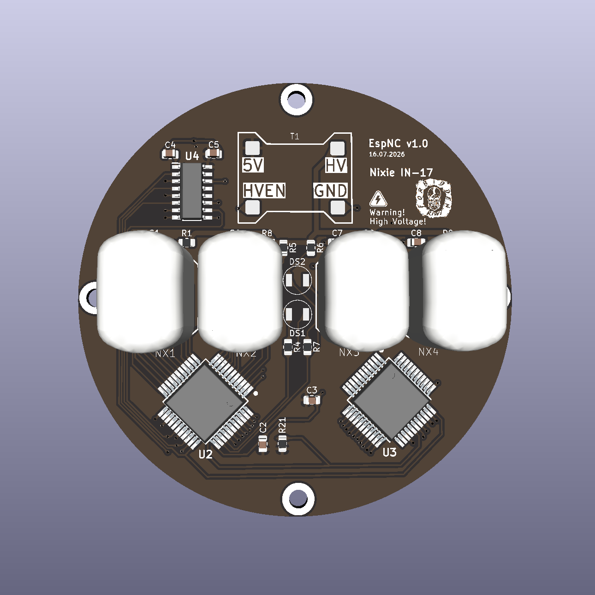
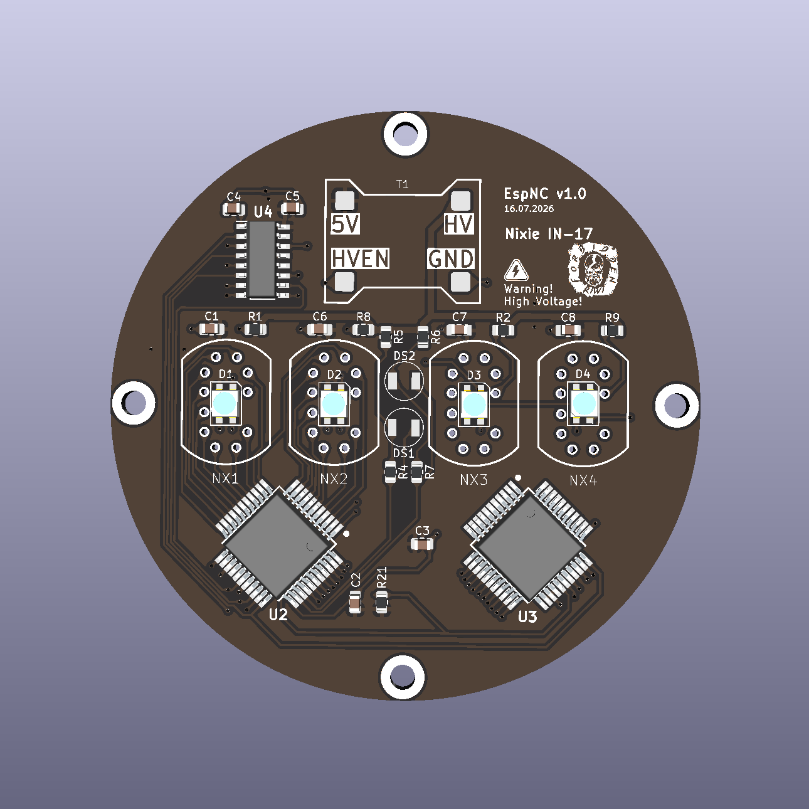
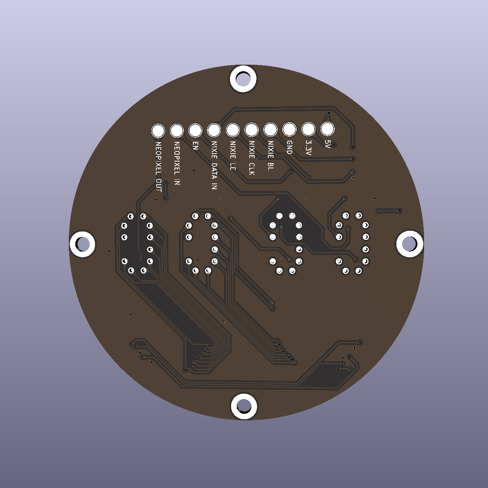
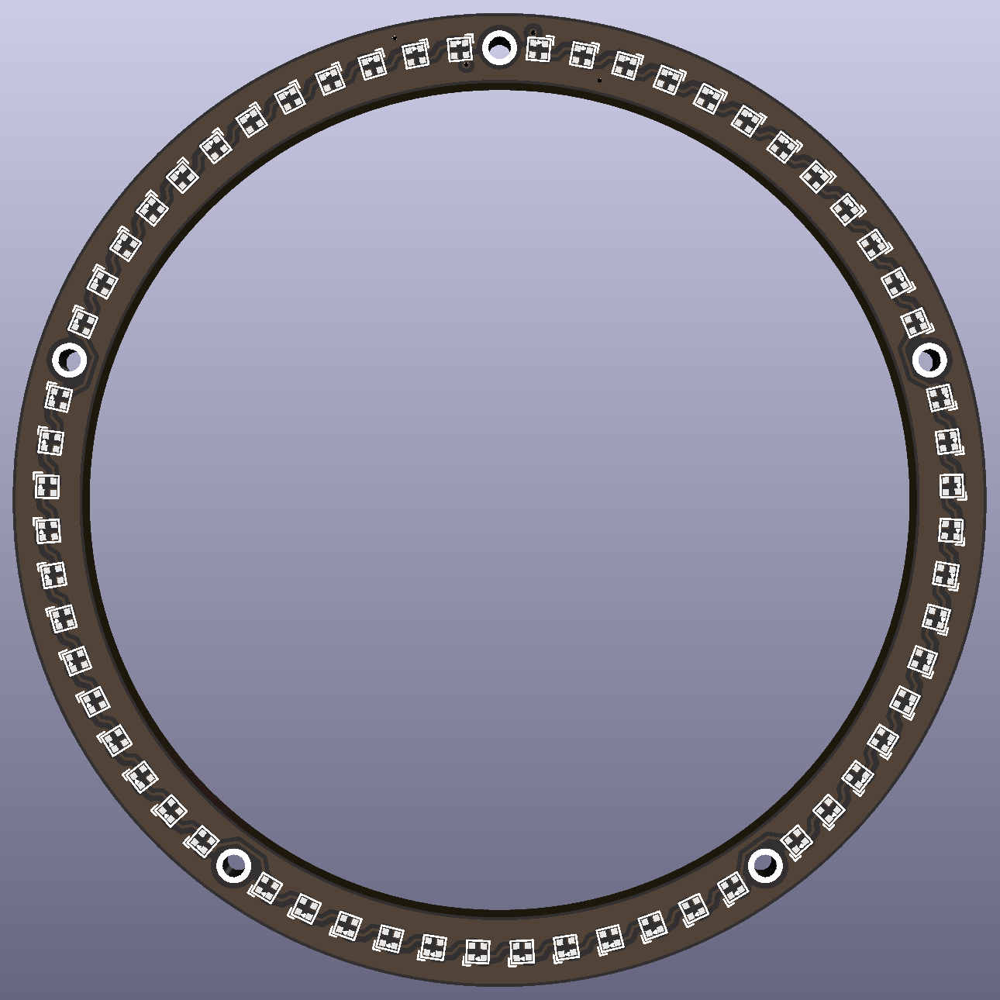
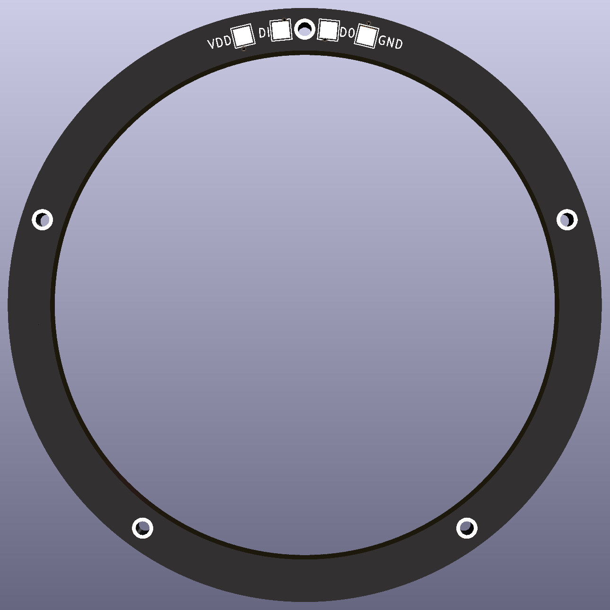

# EspNixieClock-ESP32-4Tubes

WiFi Nixie NTP clock firmware for a **4-tube** display, running on **Waveshare ESP32-C6-LCD-1.47** (onboard ST7789 TFT, **4 MB flash**), with WS2812 tube backlight, seconds ring, and rotary encoder.

Companion project: [EspNixieClock-ESP8266-6Tubes](https://github.com/forbidden-kiwi/EspNixieClock-ESP8266-6Tubes) (6 tubes, OLED).

# Features

- ESP32-based (Arduino IDE), board: **Waveshare ESP32-C6-LCD-1.47** (ST7789 320x172, 4 MB flash)
- NTP time synchronisation
- Captive-portal WiFi setup — **store up to 2 WiFi credentials** (MultiWiFi / ESP_WiFiManager) on **FFat**
- TFT + encoder menus: timezone, Auto DST (regional rules), 12/24h, colon blink, leading zero
- WS2812 tube backlight: rainbow, color cycle, static colors, brightness
- Independent 60-LED seconds ring: off / fill / dot, color and brightness
- Auto shutoff (night mode), cathode protection (slot machine), optional roll-down digits
- Date on the tubes (two frames) with configurable interval and format
- TFT screensaver (bouncing logo or display off); first rotate/press returns to TOP
- Manual set time/date or sync via WiFi; settings stored in EEPROM

### Getting started

1. Download the latest [release ZIP](https://github.com/forbidden-kiwi/EspNixieClock-ESP32-4Tubes/releases) (includes libraries).
2. Copy `Software/libraries/*` into your Arduino sketchbook `libraries` folder.
3. Open `Software/EspNC/EspNC.ino` in Arduino IDE.
4. Select board settings as below (**4 MB**, FATFS partition).
5. Upload; connect to the WiFi portal shown on the TFT and save up to two networks.

Pin map: `Software/EspNC/Globals.h`.

### Arduino IDE board settings

Waveshare reference (ESP32-C6-LCD-1.47 demo):

Source: [Waveshare docs image](https://docs.waveshare.com/assets/images/ESP32-C6-LCD-1.47_Demo1-d799732cb7c77c47a8fe78182f4779fa.webp)

| Setting | Value |
|--------|--------|
| Board | ESP32C6 Dev Module |
| USB CDC On Boot | **Enabled** (Serial Monitor over USB; Waveshare demo often leaves this Disabled) |
| Flash Size | **4MB (32Mb)** |
| Partition Scheme | **No OTA (2MB APP/2MB FATFS)** |

Same flash size and partition scheme as the Waveshare demo (FFat / FATFS). Do **not** select 8 MB flash / 8M partitions (boot-loop: `Detected size(4096k) … header(8192k)`).

### Hardware / PCB

IN-17 4-tube main board (KiCad renders). Schematics: [`Schematics/Schematics-v1.0-IN-17.pdf`](Schematics/Schematics-v1.0-IN-17.pdf). BOM: [`Bom/BOM.md`](Bom/BOM.md). Gerbers: [`Gerber/`](Gerber/).

### Seconds ring PCB

Neopixel 1010 seconds ring. Gerber: [Gerber/Neopixel-1010-Ring-Gerber.zip](Gerber/Neopixel-1010-Ring-Gerber.zip).

### Menu

### License

GNU General Public License v3.0

